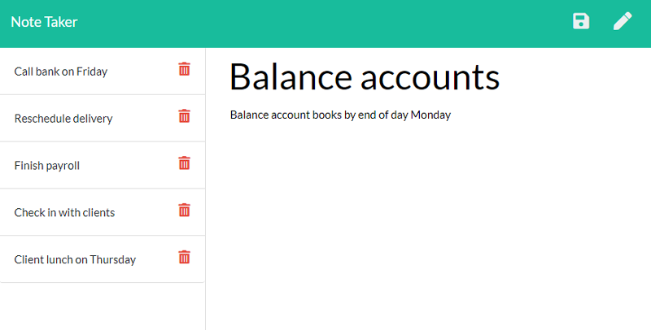

# Note Taker

## Description

My assignment was to modify a starter code to create an application called Note Taker that could be used to write and save notes. This application would use an Express.js back end and will save and retrieve note data from a JSON file.

The application’s front end has already been created. My job was to build the back end, connect the two, and then deploy the entire application to Heroku.

## Screenshots

The following images show the web application's appearance and functionality: 




## Installation

```
npm init --y
npm i express
npm i uuid
```

## Deployment

The demonstration of the application functionality can be available by clicking on [deployed application](https://note-taker-0221.herokuapp.com/)
